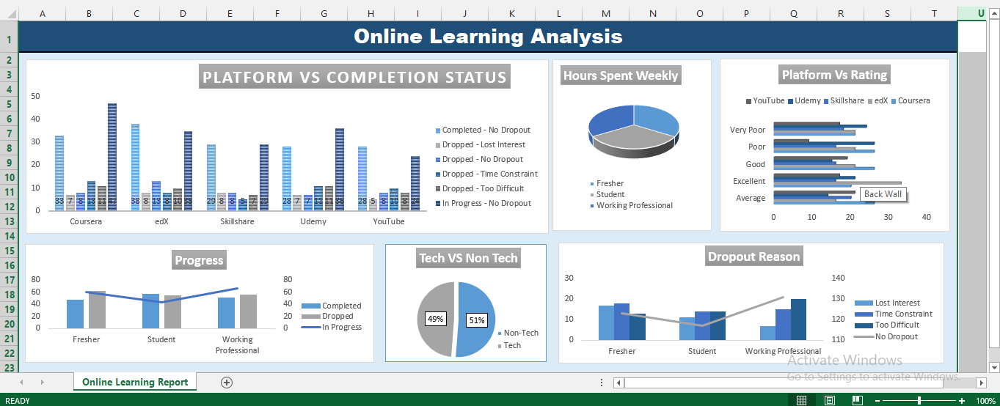

# 📊 Online Learning Analysis Dashboard (Excel)

This project is an Excel-based dashboard created to analyze online learning platforms, learner engagement, completion status, and dropout reasons.

## 🖼️ Dashboard Preview

## 📁 Project Files
- `Online Courses Analysis.xlsx`

## 🔍 Key Analysis
- Platform-wise course completion and dropout status
- Dropout reasons (Lost Interest, Time Constraint, Course Difficulty)
- Weekly hours spent on online learning
- Learner progress (Fresher, Student, Working Professional)
- Platform-wise ratings
- Tech vs Non-Tech course comparison

## 🛠️ Tools Used
- Microsoft Excel
- Pivot Tables
- Pivot Charts
- Slicers and Filters

## 🎯 Objective
To understand trends in online learning and analyze learner behavior using an interactive Excel dashboard.

## ▶️ How to Use
1. Download the Excel file.
2. Open it in Microsoft Excel (desktop version recommended).
3. Use filters and slicers to explore the dashboard.

## 📌 Use Case
Suitable for academic projects, data analysis portfolios, and entry-level analyst roles.
